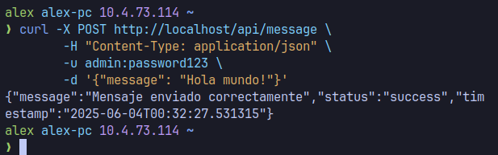
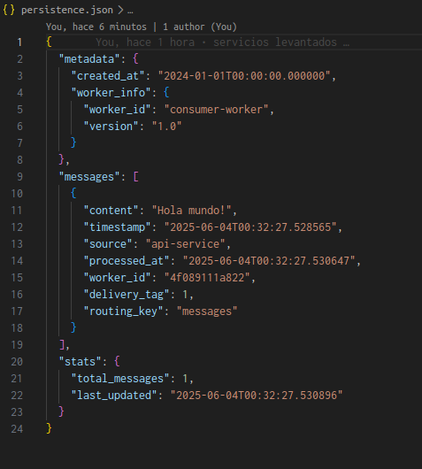
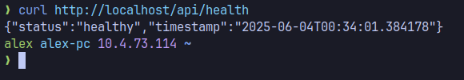
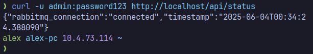
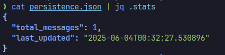
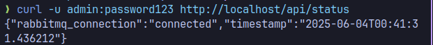
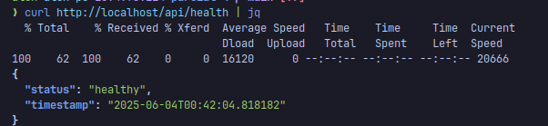
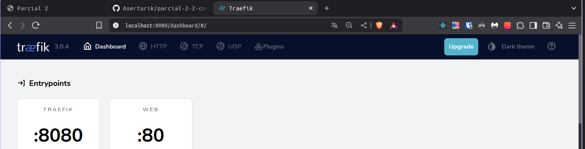
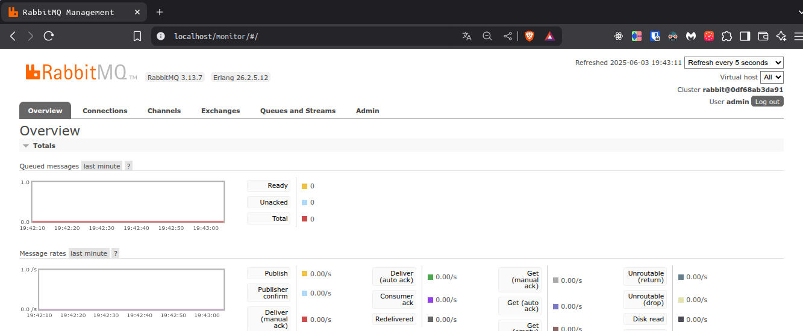
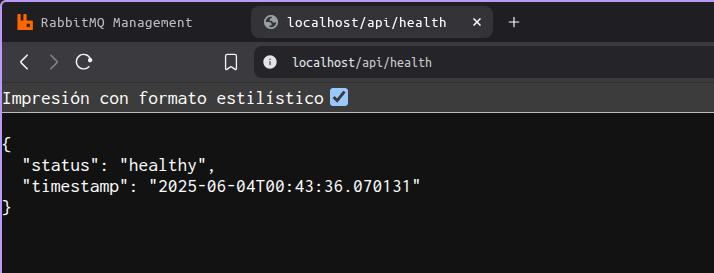

# Proyecto Parcial 4 - Arquitectura de Microservicios

**Autor:** Alex Hernández
# 1 Conceptos teóricos

## 1.1 RabbitMQ

### ¿Qué es RabbitMQ?

RabbitMQ es un servicio que implementa colas de mensajeria para la gestion de mensajes entre aplicaciones que pueden correr en docker. Implementando el protocolo AMQP. 

### Cola vs Exchange Fanout

- **Cola (Queue):** Comunicación **punto a punto**. Un mensaje se entrega a **un solo consumidor**. Ideal para distribución de trabajo entre workers.
- **Exchange Fanout:** Comunicación **uno a muchos**. Un mensaje se envía a **todas las colas** conectadas. Ideal para notificaciones o eventos que múltiples servicios necesitan procesar.

### Dead Letter Queue (DLQ)

Una **DLQ** es una cola especial donde se envían mensajes que no pueden ser procesados exitosamente (fallos repetidos, TTL expirado, cola llena).

**Configuración:**

```json
"x-dead-letter-exchange": "dlx-exchange",
"x-dead-letter-routing-key": "failed",
"x-message-ttl": 60000
```

## 1.2 Docker y Docker Compose

### Volumen vs Bind Mount

- **Volumen:** Gestionado por Docker, almacenado en `/var/lib/docker/volumes/` es una ruta de la maquina host que almacena lo que los contenedores necesiten fuera de estos.

  ```yaml
  volumes:
    - data_volume:/app/data  # Docker gestiona la ubicación dentro de contenedor.
  ```

- **Bind Mount:** Mapea directamente un directorio del host

  ```yaml
  volumes:
    - /host/path:/app/data  # Ruta específica del host como en el persistence.json
  ```

### network_mode: host

Elimina el **aislamiento de red** del contenedor. El contenedor usa directamente la red del host:

## 1.3 Traefik

### Función en Microservicios

Traefik actúa como **reverse proxy** y **load balancer** que:

- Enruta tráfico basado en reglas (host, path, headers)
- Descubre servicios automáticamente (Docker, Kubernetes)
- Balancear carga entre instancias
- Termina SSL/TLS centralizadamente

### Certificados TLS Automáticos

Traefik integra Let's Encrypt para certificados automáticos:

```yaml
traefik:
  command:
    - --certificatesresolvers.letsencrypt.acme.email=alex@example.com
    - --certificatesresolvers.letsencrypt.acme.storage=/acme.json
    - --certificatesresolvers.letsencrypt.acme.httpchallenge.entrypoint=web
  labels:
    - "traefik.http.routers.api.tls.certresolver=letsencrypt"
```

**Proceso:** Traefik solicita, valida y renueva certificados automáticamente.

---
# 2 Desarrollo práctico:

## Arquitectura

Sistema de microservicios con:

- **API REST** (Flask) que publica mensajes a RabbitMQ
- **Worker** que consume y procesa mensajes
- **Traefik** como reverse proxy
- **RabbitMQ** como broker de mensajes
- **Persistencia** en archivo JSON

## Servicios

| Servicio | Puerto | Acceso | Descripción |
|----------|--------|--------|-------------|
| **API Service** | 5000 | `/api/*` | Endpoints REST con autenticación |
| **RabbitMQ** | 5672 | `/monitor` | Broker de mensajes |
| **Traefik** | 80/8080 | Dashboard | Reverse proxy |
| **Worker** | - | - | Procesa mensajes en background |

## Inicio Rápido

```bash
# Clonar e iniciar
git clone https://github.com/Aserturik/parcial-2-2-corte-distri.git
cd parcial-2-2-corte-distri
docker-compose up -d

# Verificar estado
docker-compose ps
```

## Endpoints API

### Autenticación

- **Usuarios:** `admin:password123` / `user:userpass`
- **Método:** HTTP Basic Auth

### Endpoints Principales

```bash
# Enviar mensaje (requiere auth)
curl -X POST http://localhost/api/message \
  -H "Content-Type: application/json" \
  -u admin:password123 \
  -d '{"message": "Hola mundo!"}'

# Health check API (sin auth)
curl http://localhost/api/health

# Estado RabbitMQ (requiere auth)
curl -u admin:password123 http://localhost/api/status
```

**Ejemplo de envío de mensaje:**


**Mensajes persistidos en persistence.json:**


**Health check del API:**


**Estado de RabbitMQ:**


## Monitoreo y Salud

### Health Checks

- **API Service:** `http://localhost/api/health`
- **Consumer Worker:** `http://localhost:8080/health` (puerto interno)
- **Docker Health Checks:** Configurados para todos los servicios

### Logs en Tiempo Real

```bash
# Ver logs de todos los servicios
docker-compose logs -f

# Logs específicos
docker-compose logs -f api-service
docker-compose logs -f consumer-worker
docker-compose logs -f rabbitmq

# Estado de salud de contenedores
docker-compose ps
```

### Métricas y Estadísticas

```bash
# Ver estadísticas de mensajes procesados
cat persistence.json | jq .stats

# Estado detallado de RabbitMQ
curl -u admin:password123 http://localhost/api/status

# Health check completo del API
curl http://localhost/api/health | jq
```

**Estadísticas de mensajes procesados:**


**Estado detallado de RabbitMQ:**


**Health check completo del API:**


## Acceso Web

- **Traefik Dashboard:** <http://localhost:8080>
- **RabbitMQ Management:** <http://localhost/monitor> (admin/password123)
- **API Health:** <http://localhost/api/health>

**Traefik Dashboard:**


**RabbitMQ Management Interface:**


**API Health Status:**


## Flujo de Datos

1. Cliente → API (`/api/message`)
2. API → RabbitMQ (cola `messages`)
3. Worker → Consume mensajes
4. Worker → Guarda en `persistence.json`

## Comandos Útiles

```bash
# Ver logs
docker-compose logs -f consumer-worker

# Verificar mensajes procesados
cat persistence.json | jq .stats

# Reiniciar servicio
docker-compose restart api-service

# Limpiar y reiniciar
docker-compose down -v && docker-compose up -d
```

## Troubleshooting

### Monitoreo y Diagnóstico

```bash
# Verificar estado de salud de todos los servicios
docker-compose ps

# Health checks específicos
curl http://localhost/api/health
curl http://localhost:8080/health  # Worker (puerto interno)

# Verificar logs en tiempo real
docker-compose logs -f

# Ver mensajes procesados y estadísticas
cat persistence.json | jq
```

### Problemas Comunes

- **API no responde:** `docker-compose logs api-service`
- **Worker no procesa:** Verificar cola en RabbitMQ Management UI
- **Traefik no enruta:** Revisar dashboard en puerto 8080
- **Health checks fallan:** `docker-compose ps` muestra estado unhealthy
